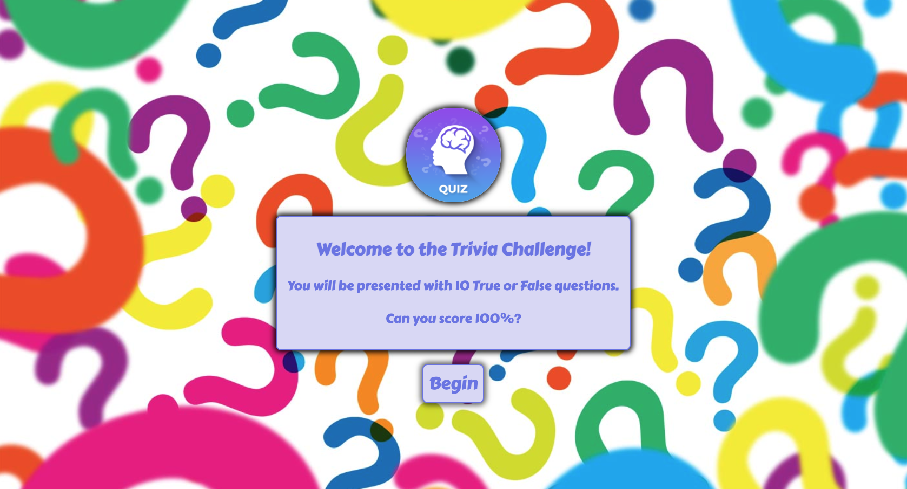
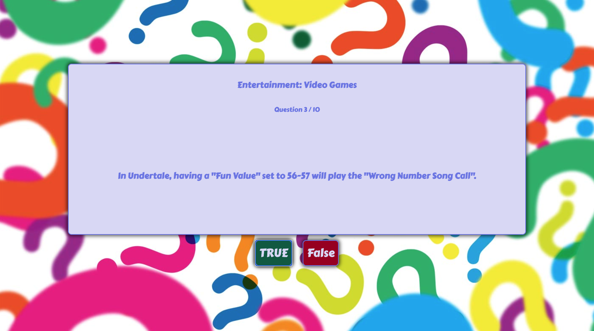
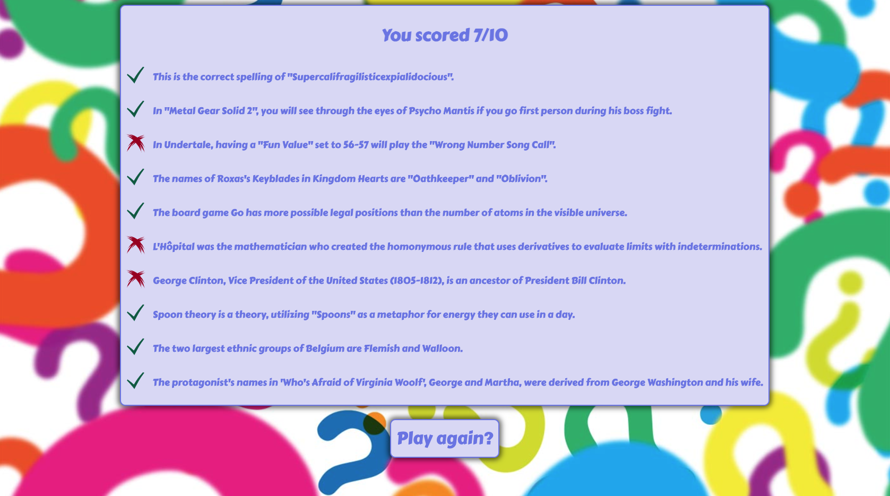

# g2i-app

This application is a 10 question, true or false quiz, created with React.

## How to use

[Deployed Website](https://jbetancourt8.github.io/g2i-app/)

Or clone the repo and run `npm install` then `npm start`.

## To do

## Screenshots

